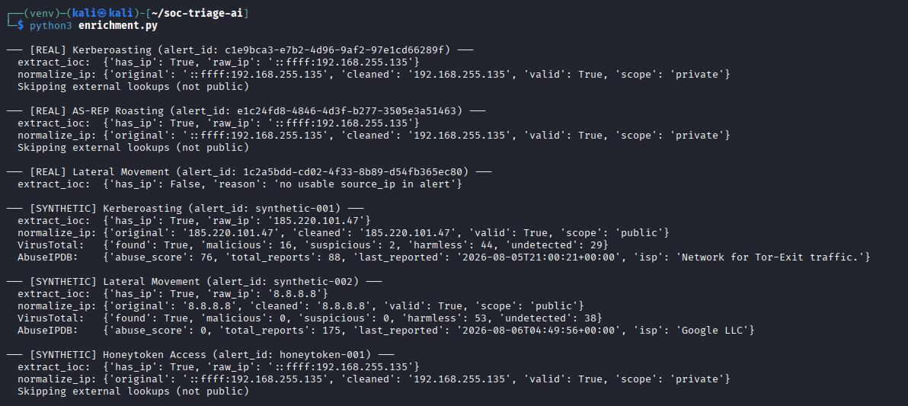

# Custom SOAR Pipeline with AI Triage 

**Tools:** Python 3 · Claude API (claude-sonnet-4-6) · Splunk Enterprise · VirusTotal API · AbuseIPDB API · VMware Workstation · Windows Server 2022 · Windows 10 · Kali Linux  
**MITRE ATT&CK:** T1558.003 · T1558.004 · T1021.002 · T1550.002 · T1078  
**Type:** Home Lab · Blue Team · SOC Automation · SOAR · AI-Assisted Triage · Honeytoken Detection · Threat Enrichment

> This project was independently designed and built as a personal home lab project, not part of coursework. All infrastructure, attack simulation, detection logic, and documentation were self-directed.

> ⚠️ **Disclaimer:** This project was conducted entirely in an isolated VMware lab environment for educational purposes only. No real systems, networks, or individuals were targeted. All IP addresses are private VMware addresses that exist solely within the local lab.

---

## TL;DR

Built a custom SOAR pipeline that ingests real Splunk alerts AND honeytoken triggers, enriches them via VirusTotal and AbuseIPDB, triages them using the Claude API, and routes them through a decision engine that automatically closes low-confidence alerts or escalates high-confidence ones. Documented two AI behavior findings: enrichment data measurably shifts Claude's confidence, and AI introduces uncertainty on definitionally certain honeytoken alerts where a rule-based system outperforms it.

---

## Overview

This project extends a previous AI triage engine into a full SOAR pipeline. Two alert sources feed the same pipeline: real Splunk/AD attack alerts and honeytoken watcher alerts from fake privileged artifacts seeded into Active Directory. Both go through the same enrichment → AI triage → decision engine → response action flow, producing a full audit trail per alert.

**What this project demonstrates end-to-end:**

1. Seed honeytokens into a live AD environment - fake service account, network share, credentials file
2. Enrich incoming alerts via VirusTotal and AbuseIPDB before Claude ever sees them
3. Feed enriched alerts to Claude API acting as a Tier 1 SOC analyst with an updated schema (attack stage, IOC extraction, concrete recommended actions)
4. Apply a tiered decision engine that routes based on confidence thresholds and alert source
5. Log every decision with a full audit trail: enrichment data → AI verdict → rule fired → action taken
6. Run honeytoken triggers through the same pipeline and compare AI behavior vs rule-based certainty
7. Document two distinct AI failure modes with architectural responses to each

---

## Lab Architecture

```
┌─────────────────────────────────────────────────────────────────┐
│                    VMware Host-Only Network                     │
│                      192.168.255.0/24                           │
│                                                                 │
│  ┌──────────────────────┐      ┌──────────────────────────────┐ │
│  │  Windows Server 2022 │      │       Ubuntu 22.04           │ │
│  │  WIN-I4UHLQF702E     │      │    Splunk Enterprise 9.3     │ │
│  │  DC: lab.local       │◄─────│    Universal Forwarder       │ │
│  │  192.168.255.130     │      │    192.168.255.131           │ │
│  │  AD DS / DNS / KDC   │      │                              │ │
│  └──────────────────────┘      └──────────────────────────────┘ │
│            │                                 ▲                  │
│            │ Domain Auth                     │ Windows Logs     │
│            ▼                                 │                  │
│  ┌──────────────────────┐                    │                  │
│  │   Windows 10         │────────────────────┘                  │
│  │   Corp-PC01          │  Universal Forwarder                  │
│  │   192.168.255.132    │                                       │
│  └──────────────────────┘                                       │
│                                                                 │
│  ┌──────────────────────┐                                       │
│  │   Kali Linux         │  Runs attacks + hosts SOAR pipeline   │
│  │   192.168.255.135    │  Impacket · CrackMapExec · Python     │
│  └──────────────────────┘                                       │
└─────────────────────────────────────────────────────────────────┘
                          │
              ┌───────────┴────────────┐
              │                        │
              ▼                        ▼
   Source 1: Splunk Alerts    Source 2: Honeytoken Watcher
              │                        │
              └───────────┬────────────┘
                          ▼
              ┌───────────────────────┐
              │   enrichment.py       │
              │   VT · AbuseIPDB      │
              └───────────────────────┘
                          │
                          ▼
              ┌───────────────────────┐
              │   ai_triage.py        │
              │   Claude API          │
              └───────────────────────┘
                          │
                          ▼
              ┌───────────────────────┐
              │   decision_engine.py  │
              │   Rule-based routing  │
              └───────────────────────┘
                          │
              ┌───────────┴────────────┐
              │                        │
              ▼                        ▼
        AUTO_CLOSE               ESCALATE
        Log + audit         Response action
                            + audit trail
```

| VM | OS | IP | Role |
|---|---|---|---|
| WIN-I4UHLQF702E | Windows Server 2022 | 192.168.255.130 | Domain Controller (lab.local) |
| Corp-PC01 | Windows 10 22H2 | 192.168.255.132 | Domain-joined workstation |
| Ubuntu VM | Ubuntu 22.04 | 192.168.255.131 | Splunk Enterprise Server |
| Kali Linux | Kali Rolling | 192.168.255.135 | Attacker machine + pipeline host |

---

## Pipeline Architecture

### Module Structure

```
soc-triage-ai/
├── soar_pipeline.py          # Orchestrator - runs the full loop
├── enrichment.py             # VirusTotal + AbuseIPDB lookups
├── ai_triage.py              # Claude API triage with updated schema
├── decision_engine.py        # Routing rules with documented rationale
├── response_actions.py       # Executes decisions, writes audit log
├── honeytoken_watcher.py     # Honeytoken trigger → pipeline feed
├── alerts/
│   ├── normalized_alerts.json        # 38 real lab attack alerts
│   └── synthetic_test_alerts.json    # Public-IP test cases
└── results/
    ├── pipeline_results.json         # Full results per alert
    └── soar_audit_log.jsonl          # Append-only audit trail (JSONL)
```

### Build Order

The pipeline was built module by module, each tested in isolation before wiring together:

1. `enrichment.py` - built and tested first, independently of everything else
2. `ai_triage.py` - adapted from Project 1's `triage_engine.py`, updated schema, dual input
3. `decision_engine.py` - routing rules designed after observing AI triage output
4. `response_actions.py` - audit trail and execution layer, TheHive stubbed
5. `soar_pipeline.py` - orchestrator wired all four modules together
6. `honeytoken_watcher.py` - added last, feeds into the same pipeline as Splunk alerts

Each module has one job and knows nothing about the others. `enrichment.py` doesn't know Claude exists. `decision_engine.py` doesn't know what VirusTotal is. This separation means swapping any single piece (e.g. replacing `enrichment.py` with a Cortex custom analyzer in v2) doesn't touch anything else.

### Data Flow Per Alert

```
alert dict
    ↓
extract_ioc() → normalize_ip() → check_virustotal_ip() → check_abuseipdb()
    ↓
enrichment bundle: {scope, cleaned_ip, virustotal{}, abuseipdb{}}
    ↓
triage_alert(alert, enrichment) → Claude API
    ↓
triage result: {severity, verdict, attack_stage, mitre_technique,
                false_positive_probability, iocs[], recommended_actions[]}
    ↓
decide(alert, enrichment, triage) → {action, rule_fired, reason}
    ↓
execute(alert, enrichment, triage, decision) → audit log entry
```

---

## Phase 1 - Honeytoken Deployment

Three honeytoken artifacts seeded into the live AD environment. No legitimate process or user should ever touch these so any interaction is definitionally malicious.

```powershell
# Fake privileged service account
New-ADUser `
  -Name "svc_backup_admin" `
  -SamAccountName "svc_backup_admin" `
  -Description "Backup Service Administrator - DO NOT DELETE" `
  -Enabled $true `
  -AccountPassword (ConvertTo-SecureString "P@ssw0rd123!" -AsPlainText -Force) `
  -PasswordNeverExpires $true

# Fake network share with tempting name
New-Item -Path "C:\IT_Credentials" -ItemType Directory
New-SmbShare -Name "IT_Credentials" -Path "C:\IT_Credentials" -FullAccess "Everyone"

# Fake credentials file inside the share
@"
# Internal IT Credentials - CONFIDENTIAL
[Domain Admin]
username=Administrator
password=Adm1n@Corp2026!
[Backup Service]
username=svc_backup_admin
"@ | Out-File -FilePath "C:\IT_Credentials\credentials.txt"
```

**Why "Everyone" full access on the share:** makes it look like a misconfiguration to an attacker enumerating shares; more tempting to touch, which is the goal.

---

## Phase 2 - Enrichment Engine (`enrichment.py`)

Enriches every alert before Claude sees it. Private IPs (all real lab data) skip external lookups with a clear reason. Public IPs (synthetic test cases) get full VirusTotal + AbuseIPDB lookups.

### Key Design Decisions

**Private/public gating:** Python's `ipaddress.ip_address().is_private` determines whether external lookups apply. Calling VirusTotal on a `192.168.x.x` address would return nothing useful. The gate prevents wasted API calls and garbage results.

**IPv6 wrapper handling:** Lab alerts arrive as `::ffff:192.168.255.135`. `normalize_ip()` strips the `::ffff:` prefix before classification.

**Graceful failure:** Every external lookup is wrapped in `try/except`. A failed API call returns an error dict instead of crashing the pipeline mid-batch.

```python
def extract_ioc(alert: dict) -> dict:
    raw_ip = alert.get("source_ip")
    if not raw_ip or raw_ip == "unknown":
        return {"has_ip": False, "reason": "no usable source_ip in alert"}
    return {"has_ip": True, "raw_ip": raw_ip}

def normalize_ip(raw_ip: str) -> dict:
    cleaned = raw_ip.replace("::ffff:", "")
    try:
        ip_obj = ipaddress.ip_address(cleaned)
    except ValueError:
        return {"original": raw_ip, "cleaned": cleaned, "valid": False, "scope": "unknown"}
    return {
        "original": raw_ip,
        "cleaned": cleaned,
        "valid": True,
        "scope": "private" if ip_obj.is_private else "public"
    }

def check_virustotal_ip(ip: str) -> dict:
    url = f"https://www.virustotal.com/api/v3/ip_addresses/{ip}"
    headers = {"x-apikey": VT_API_KEY}
    # ... request + error handling
    stats = data["data"]["attributes"]["last_analysis_stats"]
    return {
        "found": True,
        "malicious": stats.get("malicious", 0),
        "suspicious": stats.get("suspicious", 0),
        "harmless": stats.get("harmless", 0),
        "undetected": stats.get("undetected", 0)
    }

def check_abuseipdb(ip: str) -> dict:
    url = "https://api.abuseipdb.com/api/v2/check"
    headers = {"Key": ABUSEIPDB_API_KEY, "Accept": "application/json"}
    params = {"ipAddress": ip, "maxAgeInDays": 90}
    # ... request + error handling
    return {
        "abuse_score": data.get("abuseConfidenceScore", 0),
        "total_reports": data.get("totalReports", 0),
        "last_reported": data.get("lastReportedAt", None),
        "isp": data.get("isp", None)
    }
```

### Enrichment Results - Synthetic Test IPs

| IP | Type | VT Malicious | AbuseIPDB Score | ISP |
|---|---|---|---|---|
| `185.220.101.47` | Tor exit node | 16/91 | 77/100 (88 reports) | Network for Tor-Exit traffic |
| `8.8.8.8` | Google DNS | 0/91 | 0/100 (174 reports) | Google LLC |

---

## Phase 3 - AI Triage Engine (`ai_triage.py`)

Updated Claude API integration with an enriched schema. Claude now receives both the raw alert and the enrichment bundle, producing a richer verdict.

### Updated Triage Schema

```json
{
  "severity": "Critical | High | Medium | Low",
  "verdict": "True Positive | Likely True Positive | Requires Investigation | Likely False Positive",
  "attack_stage": "Reconnaissance | Initial Access | Execution | Persistence | ...",
  "mitre_tactic": "TA00XX - Tactic Name",
  "mitre_technique": "T1XXX - Technique Name",
  "mitre_confidence": "High | Medium | Low",
  "false_positive_probability": 0-100,
  "iocs": ["list", "of", "observed", "indicators"],
  "escalate": true | false,
  "escalation_reason": "string or null",
  "evidence_summary": "2-3 sentence analyst summary",
  "recommended_actions": ["Concrete action with account/IP/host names"],
  "analyst_notes": "caveats, confidence gaps, missing data"
}
```

**Key changes from Project 1:**
- `attack_stage` added - where in the kill chain this alert sits
- `iocs` added - explicit list of extracted observables for case attachment
- `recommended_actions` tightened - must reference actual account names, IPs, hostnames from the alert. No vague steps.
- Function signature changed from `triage_alert(alert)` to `triage_alert(alert, enrichment)` - Claude now reasons over both together

### Triage Function

```python
def triage_alert(alert: dict, enrichment: dict) -> dict:
    combined = {"alert": alert, "enrichment": enrichment}
    combined_text = json.dumps(combined, indent=2)

    message = client.messages.create(
        model="claude-sonnet-4-6",
        max_tokens=1024,
        system=SYSTEM_PROMPT,
        messages=[{
            "role": "user",
            "content": f"Triage this SIEM alert using the provided enrichment data:\n\n{combined_text}"
        }]
    )
    # ... parse + return
```

---

## Phase 4 - Decision Engine (`decision_engine.py`)

Three rules applied in priority order. Every decision is returned as a structured dict with the rule that fired and the reasoning - not just the outcome.

```python
# Rule priority
# 1. Honeytoken source → always escalate, AI verdict bypassed
# 2. AI flagged for escalation + FP prob < 20% → escalate
# 3. High/Critical severity + FP prob < 40% → escalate
# Default → AUTO_CLOSE + log

def decide(alert: dict, enrichment: dict, triage: dict) -> dict:

    source = alert.get("source", "splunk")
    severity = triage.get("severity", "Low")
    fp_prob = triage.get("false_positive_probability", 100)
    escalate_flag = triage.get("escalate", False)

    if source == "honeytoken":
        return _build_decision(action="ESCALATE",
            rule_fired="Rule 1: Honeytoken",
            reason="Honeytoken triggered — trap set by defenders, any access is definitionally malicious. AI verdict bypassed by design.")

    if escalate_flag and fp_prob < 20:
        return _build_decision(action="ESCALATE",
            rule_fired="Rule 2: AI escalation + strict threshold", ...)

    if severity in {"Critical", "High"} and fp_prob < 40:
        return _build_decision(action="ESCALATE",
            rule_fired="Rule 3: High/Critical severity + loose threshold", ...)

    return _build_decision(action="AUTO_CLOSE",
        rule_fired="Default: no escalation rule met", ...)
```

**Why Rule 1 bypasses AI:** See Finding #2 below. AI introduces uncertainty on honeytoken alerts where certainty is guaranteed by design. A rule outperforms AI here and the decision engine encodes that observation directly.

---

## Phase 5 - Response Actions + Audit Trail (`response_actions.py`)

Every decision: AUTO_CLOSE or ESCALATE writes a complete record to `results/soar_audit_log.jsonl`. JSONL format (one JSON object per line) means new records append without rewriting the file, and individual lines are greppable.

```
AUTO_CLOSED | test-001 | Rule: Default | FP prob: 45% | 2026-08-06T03:18:42+00:00
ESCALATED   | synthetic-001 | Rule 2 | FP prob: 4% | 2026-08-06T03:18:42+00:00
ESCALATED   | honeytoken-001 | Rule 1 | FP prob: 0% | 2026-08-06T03:18:42+00:00
```

**The audit trail is the answer to "what did the pipeline do and why."** Every AUTO_CLOSE is reviewable; if a real incident later shows something was missed, the full reasoning chain (enrichment data → Claude's verdict → rule fired) is preserved for retrospective tuning.

---

## Phase 6 - Pipeline Orchestrator (`soar_pipeline.py`)

Wires all four modules together. One loop, four function calls per alert, in-memory handoffs between stages (no file I/O between phases).

```python
def run_pipeline(alerts: list, label: str = "") -> list:
    for alert in alerts:
        enrichment = enrich_alert(alert)          # Phase 2
        triage_result = triage_alert(alert, enrichment)   # Phase 3
        triage = triage_result["ai_triage"]
        decision = decide(alert, enrichment, triage)       # Phase 4
        response = execute(alert, enrichment, triage, decision)  # Phase 5
        results.append({...})
```

### Full Pipeline Results - 41 Alerts

| Source | Total | ESCALATED | AUTO_CLOSED |
|---|---|---|---|
| Real lab alerts (38) | 38 | 11 | 27 |
| Synthetic test alerts (3) | 3 | 3 | 0 |
| **Total** | **41** | **13** | **28** |

---

## Phase 7 - Honeytoken Watcher (`honeytoken_watcher.py`)

Monitors for access to honeytoken artifacts and feeds triggers directly into the pipeline as structured alert dicts. Same shape as Splunk alerts, same pipeline path.

```python
HONEYTOKENS = ["svc_backup_admin", "IT_Credentials"]

def generate_honeytoken_alert(triggered_by: str, ...) -> dict:
    return {
        "alert_id": str(uuid.uuid4()),
        "attack_type": "Honeytoken Access",
        "source": "honeytoken",           # Decision engine reads this
        "honeytoken_trigger": triggered_by,
        "log_source": "honeytoken_watcher",
        # ... same fields as normalized Splunk alerts
    }
```

**In production:** `honeytoken_watcher.py` polls Splunk's REST API for Event ID 4624 logons to `svc_backup_admin` or file access events for `IT_Credentials`. Stubbed here due to Splunk Free license REST API authentication restrictions - the pipeline path, alert shape, and routing logic are fully implemented.

### Honeytoken Pipeline Results

```
HONEYTOKEN TRIGGERED: svc_backup_admin
→ Severity: Critical | Verdict: True Positive | FP Prob: 5%
→ Rule 1: Honeytoken → ESCALATE
→ Status: ESCALATED

HONEYTOKEN TRIGGERED: IT_Credentials
→ Severity: Critical | Verdict: True Positive | FP Prob: 5%
→ Rule 1: Honeytoken → ESCALATE
→ Status: ESCALATED
```

---

## Key Findings

### Finding #1 - Enrichment Measurably Shifts AI Confidence

The same Kerberoasting alert triaged twice - once without enrichment (private IP, no external data) and once with enrichment (Tor exit node, VT: 16 malicious, AbuseIPDB: 77/100):

| | Without Enrichment | With Enrichment |
|---|---|---|
| Severity | High | Critical |
| Verdict | Requires Investigation | True Positive |
| FP Probability | 45% | 4% |
| Recommended Actions | "Review TGS history" | "Block 185.220.101.47 at perimeter firewall" |

**Takeaway:** Enrichment doesn't just add context; it measurably changes Claude's confidence level and the specificity of its recommended actions. An AI verdict without external threat intel context is a different, weaker product than one with it.

### Finding #2 - AI Introduces Uncertainty on Definitionally Certain Signals

A honeytoken alert (no enrichment, internal IP) was run through AI triage without any special instruction. Result: "Requires Investigation" with 15% FP probability - hedging on something where the false positive rate is effectively zero by design.

**Why it happened:** Claude read the `synthetic: true` metadata field we included for my own tracking purposes and used it to reduce its confidence. My internal bookkeeping field leaked into Claude's reasoning and made it less decisive.

**Architectural response:** Rule 1 in the decision engine bypasses Claude's verdict entirely for honeytoken alerts. The rule doesn't ask "what did the AI think?" it asks "was this a honeytoken?" If yes, escalate immediately. This reflects real SOC practice: honeytokens route to IR, not analyst triage queues.

**Broader implication:** AI triage adds value on ambiguous signals where reasoning over incomplete data is the hard part. On unambiguous signals, a rule outperforms AI - faster, cheaper, and more decisive. The decision engine encodes this hierarchy explicitly rather than treating AI as the final word on everything.

---

## AI Triage Comparison - Three Alert Types

| | Real Kerberoasting | Tor Exit Node + RC4 | Honeytoken Access |
|---|---|---|---|
| Enrichment | Private IP, skipped | VT: 16 malicious, AbuseIPDB: 77 | Private IP, skipped |
| Severity | High | Critical | Critical |
| Verdict | Likely True Positive | True Positive | True Positive |
| FP Probability | 15% | 4% | 5% |
| Attack Stage | Credential Access | Credential Access | Initial Access |
| MITRE | T1558.003 | T1558.003 | T1078 |
| Rule Fired | Rule 3 (High + threshold) | Rule 2 (strict threshold) | Rule 1 (honeytoken) |
| Action | ESCALATE | ESCALATE | ESCALATE |

---

## Alert Schema

### Normalized Alert (Splunk)

```json
{
  "alert_id": "uuid",
  "attack_type": "Kerberoasting | AS-REP Roasting | Lateral Movement",
  "timestamp": "ISO 8601",
  "event_code": "4769 | 4768 | 4624 | unknown",
  "source_host": "ComputerName",
  "account": "Account_Name",
  "source_ip": "Client_Address",
  "service_name": "Service_Name or null",
  "logon_type": "Logon_Type or null",
  "ticket_encryption_type": "0x17 (RC4) | 0x12 (AES-256) | null",
  "raw_message": "_raw Splunk event",
  "log_source": "Splunk/WinEventLog:Security"
}
```

### Honeytoken Alert

```json
{
  "alert_id": "uuid",
  "attack_type": "Honeytoken Access",
  "source": "honeytoken",
  "honeytoken_trigger": "svc_backup_admin",
  "log_source": "honeytoken_watcher",
  "event_code": "4624",
  "logon_type": "3",
  ...same fields as Splunk alert...
}
```

---

## Detection Logic Reference

### Kerberoasting (T1558.003)

| Indicator | Malicious | Benign |
|---|---|---|
| Encryption type | 0x17 (RC4) | 0x12 / 0x11 (AES) |
| Requesting account | User account | Machine account ($) |
| Source IP | External workstation | Localhost (::1) |

### AS-REP Roasting (T1558.004)

| Indicator | Malicious | Benign |
|---|---|---|
| Target account | User with DONT_REQ_PREAUTH set | Machine account |
| Source IP | External IP | Localhost (::1) |
| Volume | Multiple accounts targeted | Single self-auth |

### Lateral Movement (T1021 / T1550.002)

| Indicator | Suspicious | Benign |
|---|---|---|
| Logon Type | 3 (Network) from unexpected source | 3 from known admin host |
| Account | Standard user on sensitive host | Admin on admin host |
| Timing | Off-hours, burst pattern | Business hours, single event |

### Honeytoken Access (T1078)

| Trigger | Action |
|---|---|
| Any logon to `svc_backup_admin` | Immediate escalation - no AI triage |
| Any access to `IT_Credentials` share | Immediate escalation - no AI triage |
| Any read of `credentials.txt` | Immediate escalation - no AI triage |

---

## Running the Pipeline

```bash
# Clone and set up
git clone https://github.com/DurgaRamireddy/soc-triage-ai
cd soc-triage-ai
python3 -m venv venv && source venv/bin/activate
pip install anthropic python-dotenv requests

# Add API keys to .env
echo 'ANTHROPIC_API_KEY=your_key' >> .env
echo 'VIRUSTOTAL_API_KEY=your_key' >> .env
echo 'ABUSEIPDB_API_KEY=your_key' >> .env

# Run full pipeline (real + synthetic alerts)
python3 soar_pipeline.py

# response_actions.py is called automatically by soar_pipeline.py
# It logs every decision to results/soar_audit_log.jsonl
# To inspect the audit log:
head -3 results/soar_audit_log.jsonl | python3 -c "
import sys, json
for line in sys.stdin:
    print(json.dumps(json.loads(line), indent=2))
    print()
"

# Run honeytoken watcher
python3 honeytoken_watcher.py

# Test enrichment only
python3 enrichment.py

# Test AI triage only (3 representative cases, ~$0.05)
python3 ai_triage.py

# Test decision engine only (no API calls)
python3 decision_engine.py
```

---

## Screenshots

### Enrichment Engine


### AI Triage Comparison


### Honeytoken Watcher


### SOAR Pipeline


### Audit Log


---

## Skills Demonstrated

- Active Directory honeytoken deployment (fake accounts, shares, credential files)
- Threat intelligence enrichment via VirusTotal and AbuseIPDB APIs
- Claude API integration with multi-input context (alert + enrichment)
- SOAR pipeline design: modular architecture with clean input/output contracts per stage
- Decision engine engineering with explicit, documented routing rules
- Alert triage schema design (severity, verdict, attack stage, IOC extraction, concrete actions)
- JSONL audit trail design for retrospective review and rule tuning
- AI behavior analysis: documenting failure modes and designing architectural responses
- MITRE ATT&CK mapping (T1558.003, T1558.004, T1021.002, T1550.002, T1078)
- Python module design: separation of concerns, defensive error handling, graceful failure

---

## Cost & Infrastructure

| Resource | Cost |
|---|---|
| Anthropic API (41 alerts + triage testing) | ~$0.76 |
| VirusTotal API | Free tier |
| AbuseIPDB API | Free tier |
| Splunk Enterprise | Free license |
| VMware Workstation | Existing license |
| **Total project cost** | **< $1** |

---

## Relationship to Project 1

This project extends the [AI Alert Triage project](https://github.com/DurgaRamireddy/AI-Powered-Alert-Triage-with-Claude-API) with a full SOAR pipeline wrapper. The core triage engine (`triage_engine.py`) was adapted into `ai_triage.py` with an updated schema and dual-input context. The original hallucination finding (AES-256 misidentified as RC4) remains documented in [`failure_analysis.md`](https://github.com/DurgaRamireddy/AI-Powered-Alert-Triage-with-Claude-API/blob/main/failure_analysis.md).

**v2 (planned):** Replace `enrichment.py` with a Cortex custom analyzer that runs the same VirusTotal/AbuseIPDB logic inside the Cortex platform demonstrating the same enrichment logic operating in an industry-standard SOAR framework.

---

## References

- [MITRE ATT&CK Framework](https://attack.mitre.org)
- [Anthropic Claude API Documentation](https://docs.anthropic.com)
- [VirusTotal API Documentation](https://developers.virustotal.com)
- [AbuseIPDB API Documentation](https://docs.abuseipdb.com)
- [Splunk SPL Reference](https://docs.splunk.com/Documentation/Splunk/latest/SearchReference)
- [Windows Security Event IDs](https://www.ultimatewindowssecurity.com/securitylog/encyclopedia/)

---

**Author:** Durga Sai Sri Ramireddy | MS Cybersecurity, University of Houston  
[](https://linkedin.com/in/durga-ramireddy)
[](https://github.com/DurgaRamireddy)
